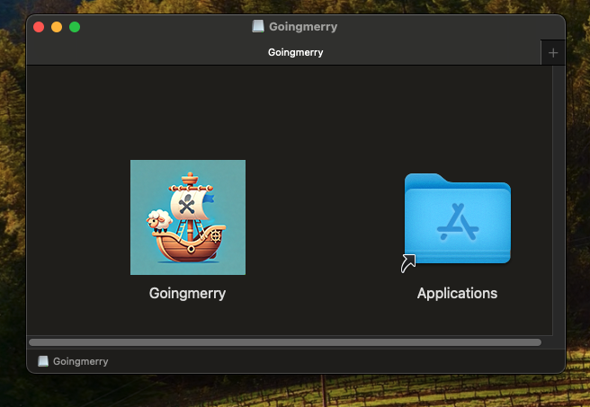

# Goingmerry



Is my second Rust based side-project for MacOS.

This application uses [Slint](https://slint.rs) for the user interface.

## Usage

1. Install Rust by following the [Rust Getting Started Guide](https://www.rust-lang.org/learn/get-started).
   Once this is done, you should have the `rustc` compiler and the `cargo` build system installed in your path.
2. Install [`cargo-generate`](https://github.com/cargo-generate/cargo-generate)
   ```
   cargo install cargo-generate
   ```
3. Set up a sample project with this template
   ```
   cargo generate --git https://github.com/slint-ui/slint-rust-template --name my-project
   cd my-project
   ```
4. Build with cargo
   ```
   cargo build
   ```
5. Run the application binary
   ```
   cargo run
   ```

It is recommended to use an IDE for development, along with the [LSP-based IDE integration for `.slint` files](https://github.com/slint-ui/slint/blob/master/tools/lsp/README.md).

You can also load this project directly in [Visual Studio Code](https://code.visualstudio.com) and install our [Slint extension](https://marketplace.visualstudio.com/items?itemName=Slint.slint).

## Package the application using cargo-packager

Details are [here](https://github.com/crabnebula-dev/cargo-packager/blob/main/README.md)

```bash

cargo install cargo-packager --locked
```

With an example for a slint app [here](https://github.com/crabnebula-dev/cargo-packager/tree/main/examples/slint)

```bash
cargo r -p cargo-packager -- -p goingmerry --release
```
